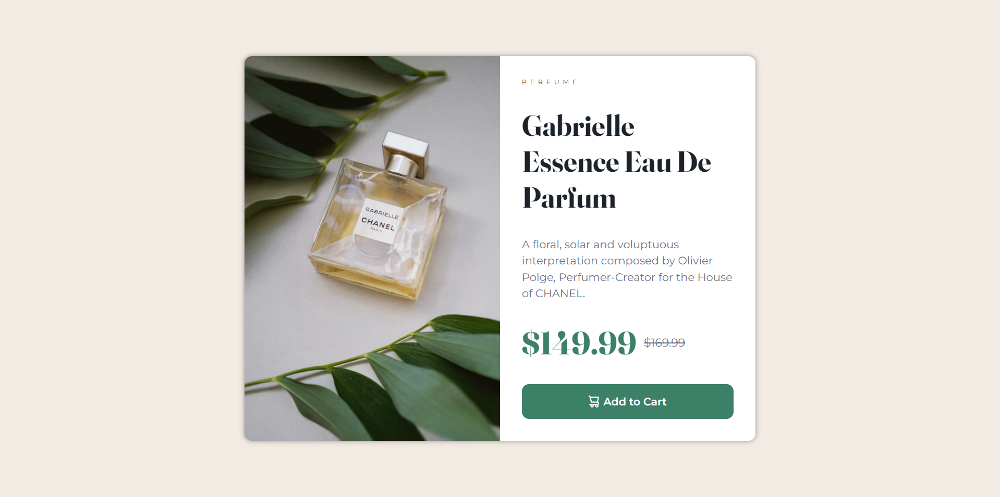
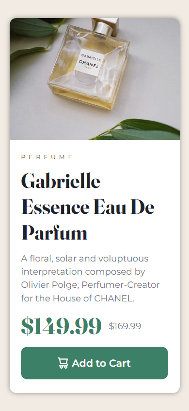

# Tarjeta de producto

En este proyecto diseñé una tarjeta detallada de un producto en venta, específicamente del producto de un perfume. Este proyecto es una solución para el desafio de **Frontend Mentor**, todos los recursos base fueron obtenidos desde dicha plataforma.

## Contenidos

- [Descripción general](#descripción-general)
  - [El desafio](#el-desafio)
  - [Screenshot](#screenshot)
  - [Links](#links)
- [Proceso](#proceso)
  - [Hecho con](#hecho-con)

## Descripción general

### El desafio

Este proyecto tuvo como desafio crear un diseño responsivo de una tarjeta de venta de un producto, especificamente de un perfume.

El sitio web tiene la capacidad de:

- Mostrar de manera responsiva la tarjeta para cada dispositivo
  - Adaptar los tamaños de fuentes
  - Adaptar el tamaño de la tarjeta
  - Adaptar margenes/paddings según tamaño de pantalla
  - Utilizar 2 imagenes iguales de diferentes tamaños según contenido de pantalla

### Screenshot

_Vista Escritorio_

_Vista Movil_

### Links

- Sitio Web: [Perfume](https://f-avalos.github.io/Perfume-Card/)

## Proceso

### Hecho con

- HTML
- CSS
  - Flexbox
  - Grid
  - Diseño Web Responsive
  - Fuentes dinámicas